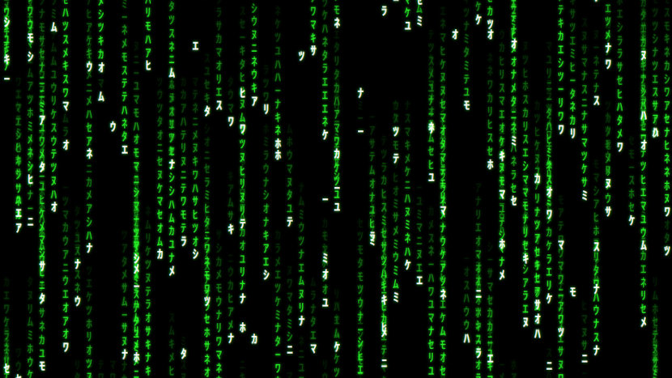

# Into the Matrix

JavaScript implementation of the famous Matrix effect for your website. Animated, of course.

## Setup

[_NodeJS_](https://nodejs.org/en/) and [_npm_](https://docs.npmjs.com/downloading-and-installing-node-js-and-npm) are required to build and develop this software.

Install the dependencies with `$ npm install`.

This software uses _NodeJS_ dependencies which won't run in the web browser unless they are compiled into native _JavaScript_ (a process called "building" which is done by the _Webpack_ dependency).

Build the package with `$ npm run build`. This will create a file `./dist/bundle.js` that you can use in your web application.

## Use

The simplest way to run the matrix effect is to open `./demo/index.html` in your web browser. The effect looks best if the browser is run in fullscreen mode (press <kbd>F11</kbd> on most browser to enter/leave fullscreen mode).

When you load the page, the number of strands will be determined by the width of the container. In the demo this is equal to the width of the viewport. If you change the size of the browser window, it's best to re-load the page to update the number of strands.

The demo also comes with a toolbar that will become visible if you move the mouse pointer to the lower edge of the window. It shows stats about the rendering and buttons to start and stop the animation.

## Develop

The source code of the demo will also show you how to use the package.

If you want to make changes in the source code of the package, you can use `$ npm run watch` to automatically re-build the package whenever you save changes.

## Limitations

The software is **not** optimized for performance yet. For a large area to cover, you will need a large processor to have a fluid animation.

## Sources & Attribution

* [Matrix Digital Rain](https://en.wikipedia.org/wiki/Matrix_digital_rain) explained on Wikipedia
